# System Architecture

## High-Level Architecture

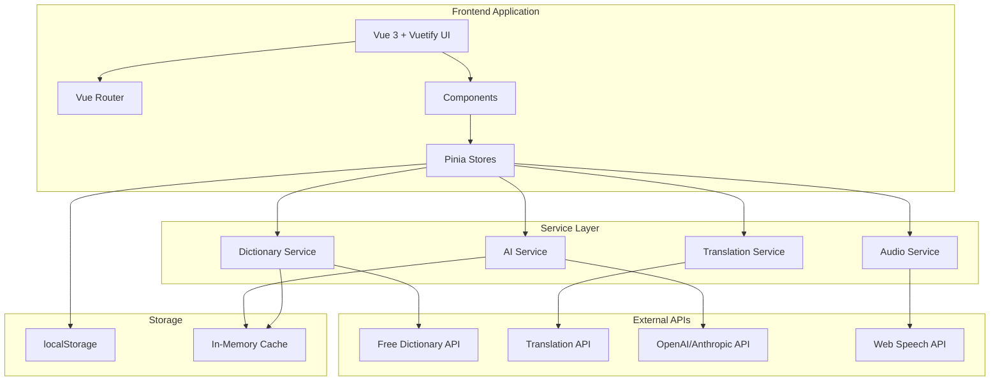

## Component Architecture

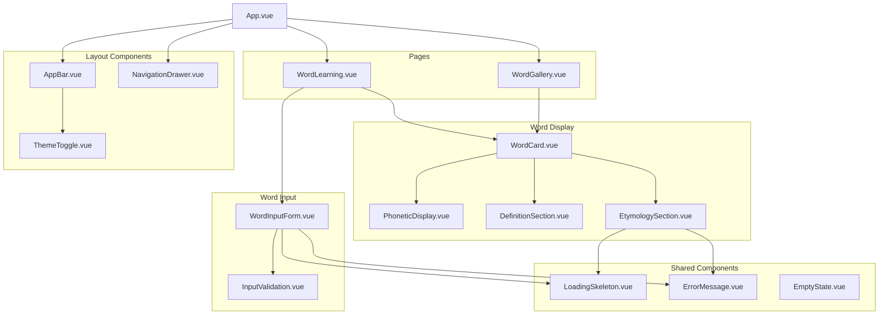

## Data Flow

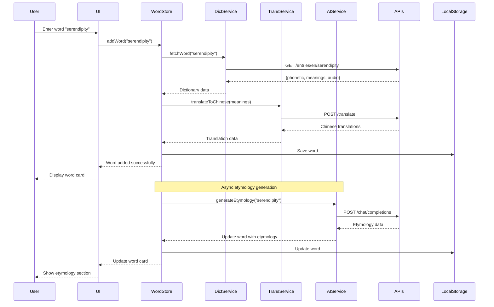

## State Management

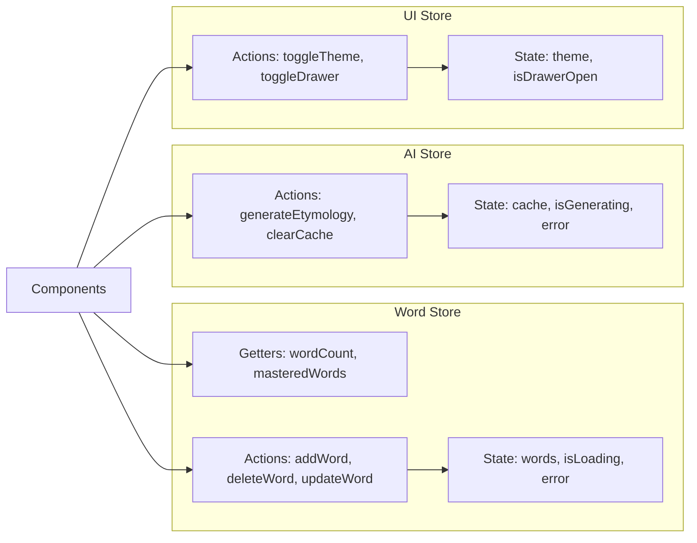

## Service Layer Architecture

```mermaid
graph TB
    subgraph "Dictionary Service"
        FetchWord[fetchWord]
        ParsePhonetic[parsePhonetic]
        ParseMeanings[parseMeanings]
        ErrorHandler1[handleError]
    end

    subgraph "Translation Service"
        TranslateCN[translateToChinese]
        CacheCheck1[checkCache]
        APICall1[callTranslationAPI]
        ErrorHandler2[handleError]
    end

    subgraph "AI Service"
        GenerateEtym[generateEtymology]
        BuildPrompt[buildPrompt]
        ParseResponse[parseResponse]
        CacheResult[cacheResult]
        ErrorHandler3[handleError]
    end

    subgraph "Audio Service"
        PlayAudio[playAudio]
        Speak[speak]
        CheckSupport[checkBrowserSupport]
        ErrorHandler4[handleError]
    end

    FetchWord --> ParsePhonetic
    FetchWord --> ParseMeanings
    FetchWord --> ErrorHandler1

    TranslateCN --> CacheCheck1
    CacheCheck1 --> APICall1
    APICall1 --> ErrorHandler2

    GenerateEtym --> BuildPrompt
    BuildPrompt --> ParseResponse
    ParseResponse --> CacheResult
    GenerateEtym --> ErrorHandler3

    PlayAudio --> CheckSupport
    Speak --> CheckSupport
    PlayAudio --> ErrorHandler4
```

## User Flow Diagrams

### Add Word Flow

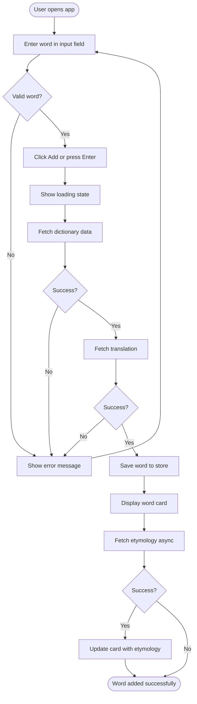

### Audio Playback Flow

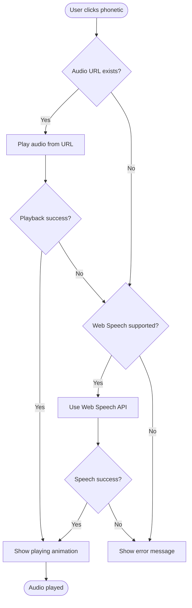

## Caching Strategy

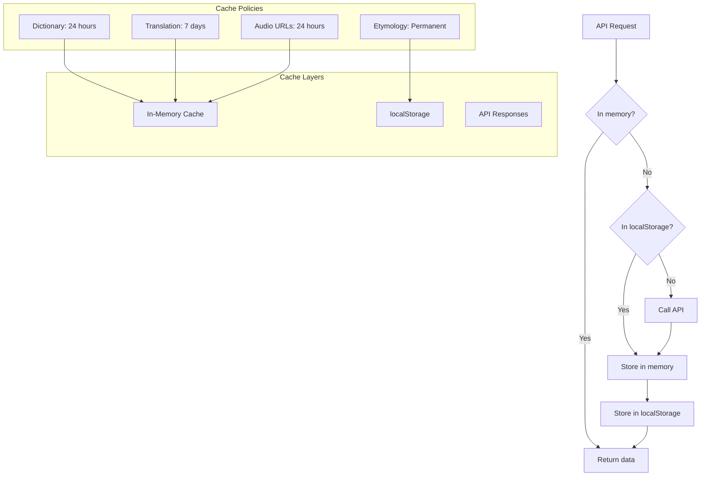

## Error Handling Flow

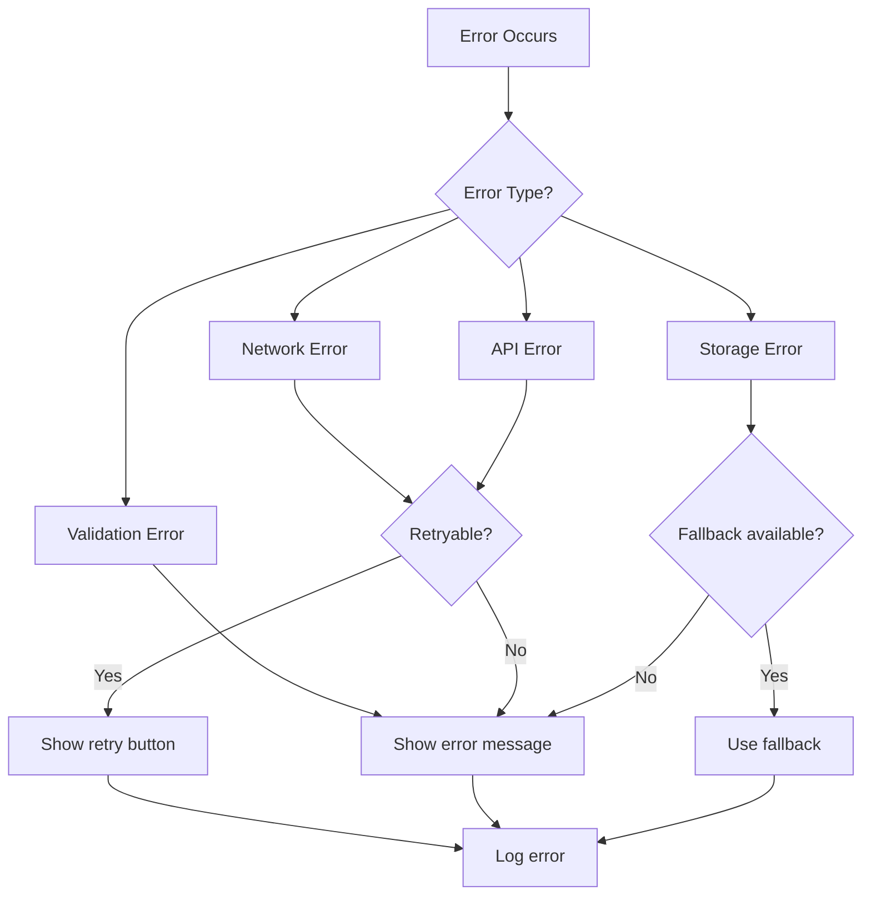

## Performance Optimization

```mermaid
graph TB
    subgraph "Bundle Optimization"
        CodeSplit[Code Splitting]
        LazyLoad[Lazy Loading]
        TreeShake[Tree Shaking]
    end

    subgraph "Runtime Optimization"
        Caching[Aggressive Caching]
        Debounce[Debounce/Throttle]
        VirtualScroll[Virtual Scrolling]
    end

    subgraph "Asset Optimization"
        ImageOpt[Image Optimization]
        FontOpt[Font Optimization]
        IconOpt[Icon Optimization]
    end

    subgraph "Rendering Optimization"
        LazyComp[Lazy Components]
        KeepAlive[Keep-Alive]
        Memo[Memoization]
    end

    App[Application]

    App --> CodeSplit
    App --> LazyLoad
    App --> TreeShake
    App --> Caching
    App --> Debounce
    App --> VirtualScroll
    App --> ImageOpt
    App --> FontOpt
    App --> IconOpt
    App --> LazyComp
    App --> KeepAlive
    App --> Memo
```

## Deployment Architecture

```mermaid
graph TB
    subgraph "Development"
        Dev[Local Development]
        DevServer[Vite Dev Server]
    end

    subgraph "Build"
        Build[npm run build]
        Optimize[Optimize Assets]
        Bundle[Create Bundle]
    end

    subgraph "Deployment"
        Vercel[Vercel]
        Netlify[Netlify]
        GHPages[GitHub Pages]
    end

    subgraph "CDN"
        Static[Static Assets]
        Cache[Edge Caching]
    end

    subgraph "Monitoring"
        Analytics[Analytics]
        Errors[Error Tracking]
        Performance[Performance Monitoring]
    end

    Dev --> DevServer
    DevServer --> Build
    Build --> Optimize
    Optimize --> Bundle
    Bundle --> Vercel
    Bundle --> Netlify
    Bundle --> GHPages

    Vercel --> Static
    Netlify --> Static
    GHPages --> Static

    Static --> Cache

    Vercel --> Analytics
    Vercel --> Errors
    Vercel --> Performance
```

## Security Architecture

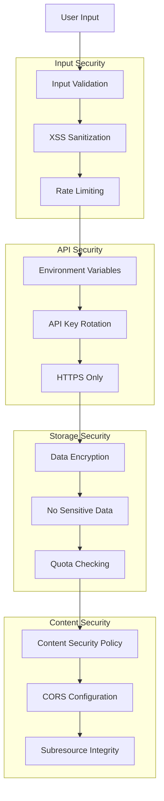

## Testing Architecture

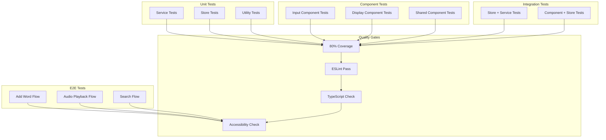

## Technology Stack Overview

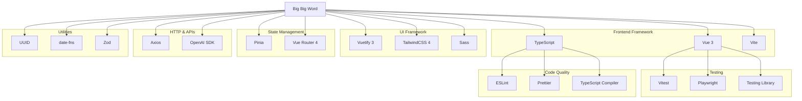

---

## Architecture Principles

### 1. Separation of Concerns

- **Presentation Layer**: Vue components (UI only)
- **Business Logic**: Pinia stores
- **Data Access**: Service layer
- **External APIs**: Isolated in services

### 2. Single Responsibility

- Each component has one clear purpose
- Each service handles one API
- Each store manages one domain

### 3. Dependency Injection

- Services are injected into stores
- Stores are injected into components
- Easy to mock for testing

### 4. Error Boundaries

- Errors caught at service layer
- Propagated to stores
- Displayed in UI components
- Logged for debugging

### 5. Performance First

- Lazy loading for routes
- Code splitting for heavy features
- Aggressive caching
- Optimized bundle size

### 6. Accessibility First

- ARIA labels everywhere
- Keyboard navigation
- Screen reader support
- Color contrast compliance

### 7. Mobile First

- Responsive design
- Touch-friendly targets
- Progressive enhancement
- Offline capability (future)

---

## Scalability Considerations

### Horizontal Scaling

- Stateless frontend (can deploy multiple instances)
- CDN for static assets
- API rate limiting per user

### Vertical Scaling

- Code splitting reduces initial load
- Lazy loading reduces memory usage
- Virtual scrolling for large lists

### Data Scaling

- IndexedDB for larger datasets (future)
- Pagination for word gallery
- Infinite scroll option

### Feature Scaling

- Plugin architecture for new features
- Feature flags for gradual rollout
- Modular component design

---

_This architecture is designed to be maintainable, scalable, and performant while providing an excellent user experience._
